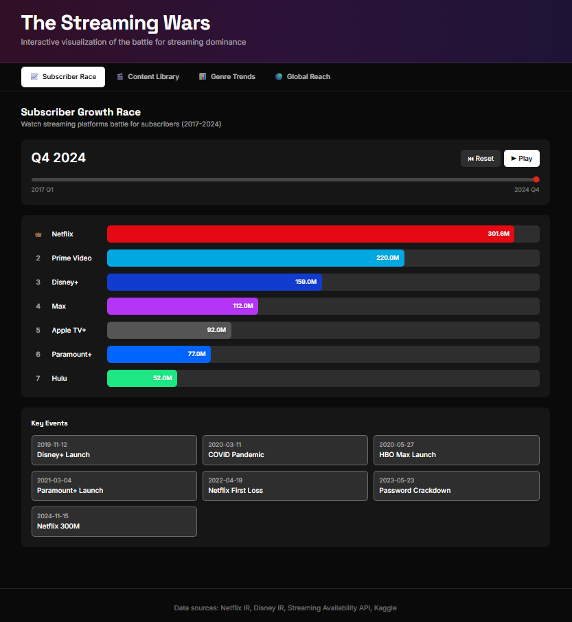
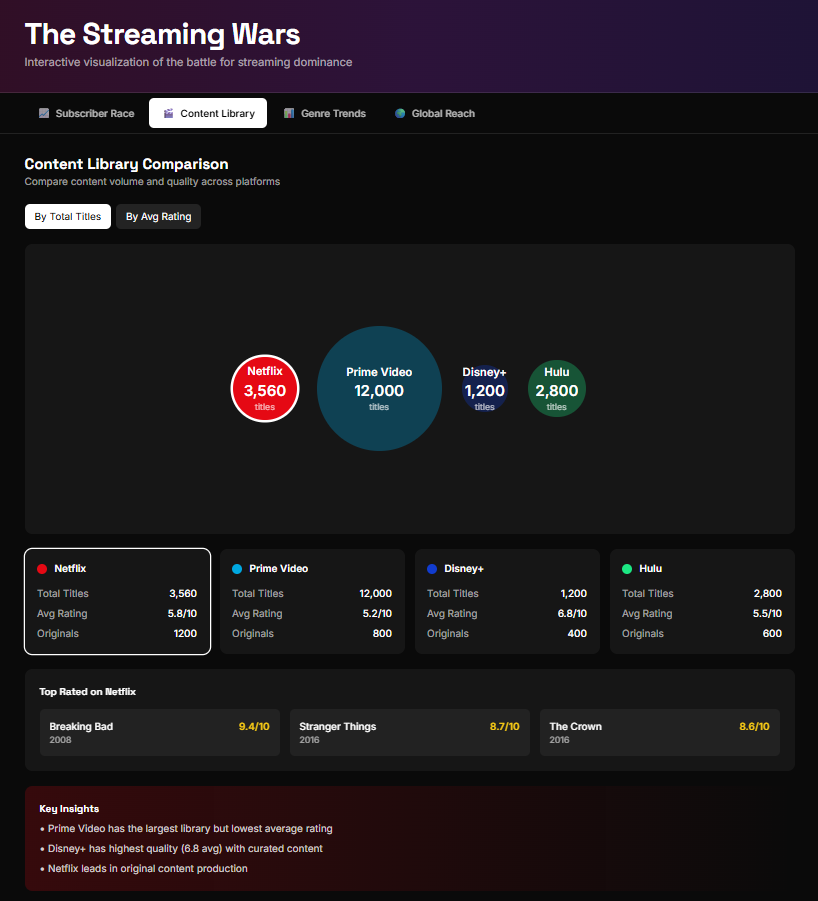
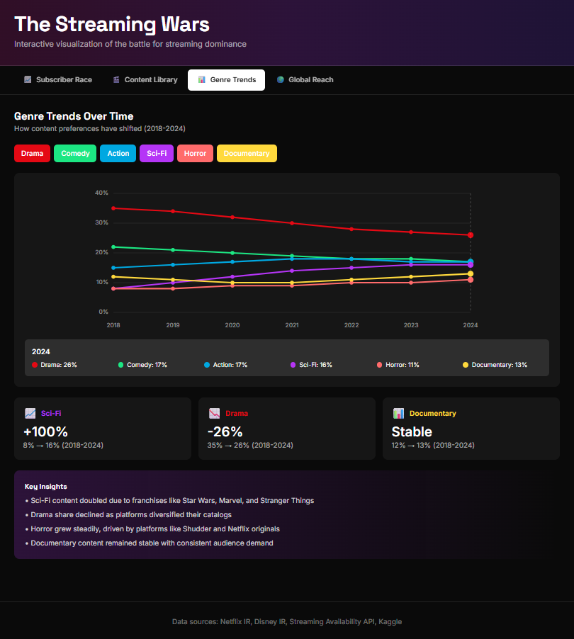
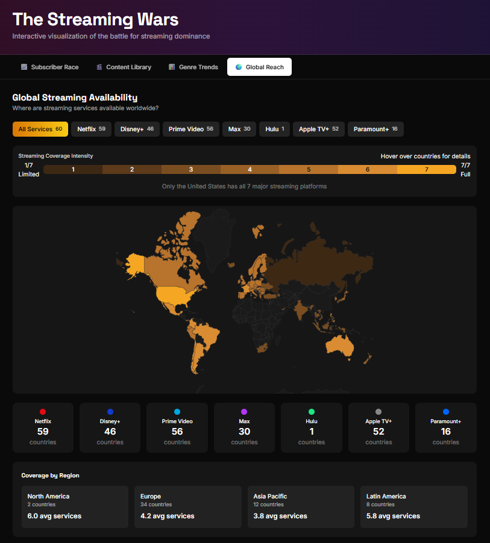

# The Streaming Wars

An interactive data visualization exploring the competitive landscape of streaming platforms from 2017-2024.

**[Live Demo]([#](https://streaming-wars.vercel.app/))**

---

## Preview

| Subscriber Race | Content Library |
|-----------------|-----------------|
|  |  |

| Genre Trends | Global Reach |
|--------------|--------------|
|  |  |

---

## About

This project visualizes the evolution of the streaming industry through four interactive features:

1. **Subscriber Race** - Animated bar chart racing showing subscriber growth across platforms (2017-2024)
2. **Content Library** - Bubble visualization comparing content volume, ratings, and original productions
3. **Genre Trends** - Line chart tracking how genre distributions have shifted over time
4. **Global Reach** - Interactive world map showing platform availability by country

## Data Sources

- Subscriber data: Company earnings reports and press releases
- Geographic availability: Streaming Availability API
- Content metrics: Aggregated from platform catalogs
- Key events: Industry news and announcements

## Tech Stack

- React 18 + TypeScript
- Vite
- Tailwind CSS
- D3.js
- react-simple-maps
- Framer Motion

## Getting Started
```bash
# Install dependencies
npm install

# Run development server
npm run dev

# Build for production
npm run build
```

## Project Structure
```
src/
├── components/
│   ├── RaceChart.tsx      # Animated subscriber race
│   ├── ContentBubble.tsx  # Content library comparison
│   ├── GenreTrends.tsx    # Genre distribution over time
│   └── GeographicMap.tsx  # World map availability
├── App.tsx                # Main layout and navigation
├── main.tsx
└── index.css
```

## Features

- Dark theme optimized for data visualization
- Responsive design for desktop and mobile
- Interactive tooltips and hover states
- Animated transitions between data states
- Platform-specific color coding throughout

## License

MIT

---

Built as a portfolio project exploring streaming industry data.
